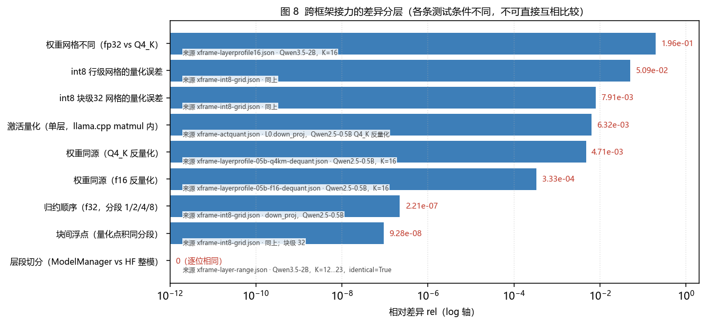
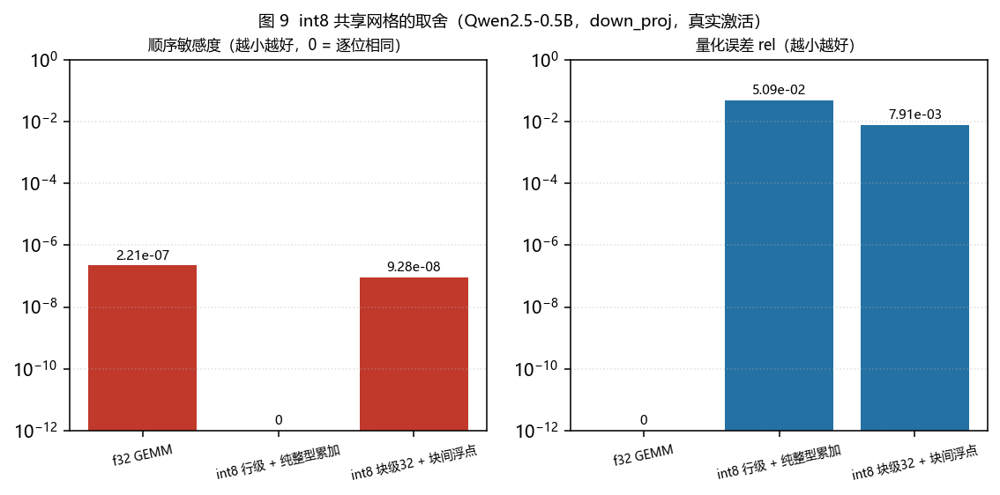

# 跨框架层接力：系列报告总览与一致性核对（2026-10-08）

> 状态：**现行**
>
> 适用范围：跨框架层接力（PyTorch D→L / llama.cpp L→L）**全部实验的索引**、**结论一致性核对**，
> 以及**引用前必读的口径注记**。单项结论的证据仍在各自报告里，本文只做索引与交叉核对。

## 0. 这份文档解决什么

跨框架接力的证据分散在「简单报告」（每次实验一份）、「数据汇总」「机理」「结论件」「项目报告」五类文档里，
时间跨度从 2026-09-15 到 2026-10-08。本文回答三个问题：

1. **一共做过哪些实验**，各自的现行结论是什么（§2）；
2. **有没有自相矛盾**（§3.1）与**重复造轮子**（§3.2）；
3. **引用某个数字时有哪些口径限制**（§5）。

## 1. 最早那个实验，以及它与上游 issue 的关联链

**最早与 llama.cpp 社区 issue 强关联的跨框架实验**是 **上游 `embd` 注入路径非确定性**（2026-09-16），
它直接产出了本仓提交的上游 issue [#28963](https://github.com/ggml-org/llama.cpp/issues/28963)
（报告人 `SgfKrc`）。

**现行结论（该报告的 §13）**：所谓"`embd` 路径非确定性"由 **调用方 `pos` 数组的堆越界读**造成 ——
`llama_batch_allocr::ubatch_add` 对 M-RoPE 模型的 `embd` 批次会读
`batch.pos[0 .. n_pos_per_embd*n_tokens)`，而 `llama_batch_init` 只分配 `n_tokens` 个条目
（valgrind：`Invalid read of size 4 … 0 bytes after a block of size 20 alloc'd`）。
⇒ **不是** llama.cpp 的架构限制，也**不是**跨框架接力的固有缺陷。

按上游给出的**调用方修法**（`pos` 按 `n_pos_per_embd * n_tokens` 分配、每段填同一位置）后的对照：

| 实验 | 修复前 | 修复后 |
| --- | --- | --- |
| `embd` 同输入连跑两次（141 位置） | argmax `126/141`、cosine 0.85–0.99 | **`141/141`、cosine min = `1.000000`** |
| `embd` vs token 路径（同一 141-token prompt） | argmax `132/141` | **`141/141`、cosine min = `0.999999`** |
| L→L 层接力 141 步贪心生成 | 第 46–67 步分叉（逐次不同） | **`141/141`、可重复** |

**同源 issue 链**（详见 `local_docs/plans/llama-cpp-issues-28441-28902-28910-vs-28963-2026-09-19.md`）：

| Issue | 性质 | 状态 |
| --- | --- | --- |
| [#28441](https://github.com/ggml-org/llama.cpp/issues/28441) | Kronk/Go 调用方真实事故（同一条越界链） | 已关闭（定位为调用方问题） |
| [#28902](https://github.com/ggml-org/llama.cpp/issues/28902) | `ubatch_add` 的位置数组契约缺陷报告 | Open |
| [#28910](https://github.com/ggml-org/llama.cpp/pull/28910) | 只把 `pos == NULL` fallback 扩容；**不覆盖显式 `pos`** | Open、未合并 |
| **#28963** | **本仓的 CPU `embd` 非确定性复现 + 独立根因确认** | Open |

⇒ **本仓的调用方补丁必须保留**（`build/cross-framework-layer-poc/patches/embd-pos-overread-fix-2026-09-16.patch`；
主仓运行时不依赖它，它只位于被忽略的实验 fork）。

**为什么它是"最早关联 issue 的实验"而不是普通数值实验**：它把「跨框架接力能不能稳定复现」这个前提
问题，追到了**上游库的调用契约**上 —— 在它之前，接力链上的不确定性被归因为"跨框架本身不稳"。

## 2. 实验清单（时间序）

| 日期 | 实验 | 现行结论（一句话） | 报告 |
| --- | --- | --- | --- |
| 09-15 | 跨框架层接力重启评估 | 路线定位与可行性边界；旧口径作废 | `archive/relay/跨框架层接力重启评估-2026-09-15.md` |
| **09-16** | **上游 `embd` 注入非确定性**（**最早关联 issue**） | **根因 = `pos` 越界读**；修后 `141/141`（§13） | `archive/relay/上游llama-embd注入非确定性-复现与issue材料-2026-09-16.md` |
| 09-16 | 同进程双后端接力实现与性能 | §0 早期结论已被本文 §12–§14 取代 | `archive/relay/同进程双后端接力实现与性能-2026-09-16.md` |
| 09-16 | 接力边界数值对齐-可行性与实验设计 | 对齐路线的设计（后由 XFRAME 系列执行） | `archive/relay/接力边界数值对齐-可行性与实验设计-2026-09-16.md` |
| 09-16 | 跨框架接力量化与加速解耦分析 | 量化与加速是两件事，别互相归因 | `archive/relay/跨框架接力量化与加速解耦分析-2026-09-16.md` |
| 09-16 | 引擎单序列与并发性能对比 | 两档引擎的档位差（起点基线） | `archive/relay/引擎单序列与并发性能对比-2026-09-16.md` |
| 09-17 | Silica 式分片调研 / 层段协议立项 | RPC 分片 vs 层接力的能力边界 | `archive/relay/Silica式分片方案调研-2026-09-17.md`、`层段协议立项-2026-09-17.md` |
| 09-18 | P0 切点扫描（`CORE-RELAY-XFRAME-02`） | 最优切点以 **GPU 上游 v2** 为准（v1 CPU 上游已废） | `docs/跨框架接力-当前有效基线与后续优化计划-2026-09-21.md` |
| 09-18 | 全 llama+CUDA vs 跨框架接力 | **接力价值 = 装得下 / 装得更好，不是单机更快** | 同上 |
| 09-18 | torch 上游开关矩阵 | 与 llama 的差距主因是**配置**而非框架上限 | 同上 |
| 09-18 | 真接力上游 2.8× 偏差 | 同机上下游内存/总线争用 | 同上 |
| 09-19 | 四项准入证据（8 分布族 / 长序列 / 弱网 / …） | 证据齐备但**准入仍 fail-closed**（终态） | `local_docs/evidence/relay-xframe/` |
| **09-19** | **上游 issue 关联调研** | #28963 与 #28441/#28902/#28910 同源；**调用方补丁保留** | `local_docs/plans/llama-cpp-issues-28441-28902-28910-vs-28963-2026-09-19.md` |
| 09-21 | 容量收益实测 | 两段收益 **1.55–1.57×**、最优 `K = N/2` | `docs/跨框架层接力-容量收益实测-2026-09-21.md` |
| 10-05 | 数值差异机理 | 逐算子定位；差异是**放大链**而非某算子算错；L1/L2/L3 三层 | `docs/跨框架接力数值差异机理-2026-10-05.md` |
| 10-05/07 | 分布式三机验收 | **同引擎基线** `12/12…256/256` | `docs/分布式三机验收证据-2026-10-05.md` |
| 10-07 | XFRAME-1…6 | 六票（算子 / 网格 / 归约 / 数域 / 递推） | `docs/分票规划-…-2026-10-04.md` 的 XFRAME 段 |
| 10-08 | 权重同源 × 通路 2×2、int8 网格 + 整型累加 | 见 `docs/跨框架接力精度结论与生产准入-2026-10-08.md` 与 §4 | 同上 |
| **10-08** | **误差优化叠加性 + 生产接入** | **四条维度可同时启用（int8 档 24/24）；"上游也量化"在档位不足时反噬（int4 档 0/24 < 9/24）；`fp32 × Q4_K_M` 是最大误差源（第 16 层 `1.96e-1` = 同源 f16 的 590×）** | `docs/跨框架接力误差优化实验报告-2026-10-08.md` |

## 3. 一致性核对

### 3.1 自相矛盾核对 —— 没有活跃矛盾；被推翻的都在登记节

**规则**（`docs/文档状态与清理清单.md` 第 15 条）：文档只写当前成立的结论，被推翻的**不在正文保留+划掉**，
只在 `archive/relay/跨框架层接力-实验数据汇总.md` 的「已推翻结论」节登记一行（现 17 条）。

本轮逐项核对的结果：

- **`embd` 实验**：`§5–§12` 的结论（"非确定性是架构/编译问题"）**已就地作废**，文首横幅说明，
  **唯一有效结论是 §13**（`pos` 越界读）⇒ 与 `local_docs/plans/llama-cpp-issues-…-2026-09-19.md` **一致**，无矛盾。
- **P0 切点扫描**：v1（CPU 上游，最优 N=3）已被 v2（GPU 上游，最优 N≈20）取代，正文只留 v2 口径。
- **同进程接力性能**：`§0` 的早期结论（828 ms/步）已被同文档 `§12–§14` 取代。
- **`3.5e-04`**：结论文档正文仍用它做"归约下界"的量级代表，但**已在证据节注明**它依赖数据与种子
  （工具复跑得 `1.80e-06`，相差约 200×）⇒ 属**已标注的口径限制**，不是矛盾。引用时见 §5。
- 其余 17 条已推翻结论见汇总文件的登记节。

### 3.2 重复造轮子核对 —— 各维度只测一次，后做的是细化/修正

把历次实验按**它真正改变的那个变量**归类，可见**没有两个实验在测同一维度**：

| 维度（唯一变量） | 实验 | 结论 |
| --- | --- | --- |
| 上游库的**调用契约** | `embd` 位置数组（09-16） | `pos` 越界读；修后 `141/141` |
| **算子实现**（RMSNorm/SiLU/SwiGLU） | XFRAME-2 | 两侧实现差异 **1e-7**；RMSNorm 逐 bit 相同 ⇒ 共享算子无收益 |
| **数据精度 / 网格** | XFRAME-3 | int8 逐通道共享 scale ⇒ 跨引擎 argmax 压回同格（`3/3`、`8/8`）；int4 不够 |
| **归约顺序** | XFRAME-4 | 下界 `O(K·ε)`；与算子层差 ~3 个数量级 |
| **累加数域** | XFRAME-5 | f64 累加下"只改顺序"差异 = `0.0` |
| **递推 / 架构分解** | XFRAME-6 | 不引入额外不可消除项（`218/218`；真链路 6 条 `tail/head < 2.0`） |
| **交界处权重同源性** | 2×2 隔离（10-08） | 权重同源只消除**权重差异**；4-bit 通路另有"激活量化" |
| **GEMM 内部算法**（整型累加） | int8 网格报告（10-08） | 纯整数累加 ⇒ 顺序敏感度 **0**；代价是量化误差 |

**判定**：后续实验都是在更细的维度上继续，或对前者做口径修正（例如把"跨框架差"细分为
"权重差 / 激活量化 / 归约顺序"）；**没有出现同一维度被重测第二次**。

**一处需要留意的"看似重复"**：`XFRAME-3`（量化 **hidden**）与 10-08 的 `int8 网格 + 整型累加`
（量化 **GEMM 的输入**）都涉及 int8 —— 但它们是**不同环节**：前者是**交界处的传输量化**（可自由选
scale 粒度，实测 `8/8`），后者是 **GEMM 内部**（scale 必须取在被累加掉的那一维上，实测顺序敏感度 0
但量化误差 `6.5e-3…5.1e-2`）。两者**互补而非重复**。

## 4. 10-08 新增两条的定位（避免与 XFRAME 混淆）

1. **权重同源 × 通路 2×2**：回答"让 PyTorch 也用 Q4_K_M 能否让误差趋同"。结论是**不能只靠它** ——
   权重同源把 4-bit 通路误差从 `9.263e-3` 降到 `4.713e-3`（`1.97×`），但 f16 通路同源**零收益**
   （`3.327e-4 → 3.325e-4`），且 f16 通路的绝对值比 4-bit 同源后还好 **14×** ⇒ 让两侧都**不走量化通路**
   比模仿 Q4_K_M 更有效。
2. **int8 网格 + 整型累加**：回答"L3（跨架构也成立的算法形态）在 PyTorch 侧可不可行"。结论是**代数上可行**：
   纯 int32 累加对不同归约分段**逐位相同**（敏感度 `0.0`），且 `torch.int32` 与 `numpy.int32` 结果**完全一致**
   ⇒ 整数域跨库/跨框架可复现。**代价**是量化误差成为新主导项：行级 scale `1.3e-2…5.1e-2`，
   块级（32）`6.5e-3…7.9e-3`（但块级要引入**块间浮点累加**，顺序敏感度回到 `1e-7` 量级，
   即"llama.cpp 的量化 GEMM 并非纯整数累加"）。
   ⇒ **取舍**：要**零顺序敏感度**就须全程整数（scale 粒度粗 ⇒ 误差大）；要**误差小**就须块级 scale
   （块间浮点累加 ⇒ 敏感度非零）。二者不能同时拿到。

## 5. 口径注记（引用前必读）

| 数字 | 限制 |
| --- | --- |
| `3.5e-04`（归约下界） | **依赖数据与种子**：工具默认（seed=1234、M=8/N=64）K=2048 实测 `1.80e-06`，与票面 `3.5e-04` 相差约 200× ⇒ 可复现的是**阶随 K 增长**，不是该具体数字 |
| `0.196` | 是 **hidden 的 `rel_err`**（Qwen3.5-2B + Q4_K 工件、K=12/16），**不是**端到端 token 差异 |
| `8/8`、`141/141`、`256/256` | **基线必须同引擎**；用 HF 整模当基线会得到"不一致"，那反映引擎差异而非接力缺陷 |
| repack 差异（`max\|Δ\|≈0.978`） | 只在**纯本机对照侧**；显式 devices（RPC/分片）时 repack 不参与 ⇒ 全 RPC ≡ 分片 ≡ 本机 no-repack（逐比特） |
| `1.55–1.57×` | 是**容量**收益，**不是**速度收益 |
| 最优切点 `N≈20` | **GPU 上游**口径（v1 CPU 上游已被 v2 取代） |
| 端到端 `3.2e-3…8.7e-3`（4-bit 通路） | 受 **llama.cpp 的激活量化**主导，与"权重用什么量化算法"无关 |

## 6. 系列报告的结构（现状与建议）

| 层 | 文档 | 职责 | 现状 |
| --- | --- | --- | --- |
| **简单报告**（每实验一份） | `docs/archive/relay/*.md`（约 12 份） | 单次实验的复现步骤 + 原始数据 | 已有；多数已归档 |
| **数据汇总** | `archive/relay/跨框架层接力-实验数据汇总.md` | 全部数字 + 条件 + **已推翻结论** | 已有 |
| **机理** | `docs/跨框架接力数值差异机理-2026-10-05.md` | 差异从哪来、能否阻止、L1/L2/L3 | 已有 |
| **结论件** | `docs/跨框架接力精度结论与生产准入-2026-10-08.md` | 生产准入判据与载体推荐 | 已有 |
| **项目报告（图文）** | `docs/跨框架层接力-项目报告.md` | 背景 / 架构 / 进展 / **图集 §6.4** | 已有（7 张图，由 `make_figures.py` 直接从 JSON 生成） |
| **本总览** | 本文 | 索引 + 一致性核对 + 口径注记 | **新增** |

**图（数值主题，2026-10-08 补齐）**：`docs/figures/cross-frame-relay/` 原有的 7 张（fig1–fig7）覆盖的是
**性能/切点**主题。本轮新增 `scripts/xframe_numeric_figures.py` —— 与既有 `make_figures.py` 同纪律
（只画报告里写过的数字、缺字段跳过、每条标注**来源 JSON** 与**测试条件**），直接从实测 JSON 生成两张
**数值**主题图（用系统 Python 跑，因其带 `matplotlib`；脚本内 `matplotlib` 为延迟导入，故单测可在
`.venv-test` 下运行）：

**图 8** 把 §3.2 的各维度放在同一对数轴上（**各条测试条件不同，不可直接互相比较**）：层段切分 `0`、
归约顺序 `2.2e-07`、块间浮点 `9.3e-08`、激活量化 `6.3e-03`、权重网格不同 `1.96e-01`。
**图 9** 是 `int8 网格 + 整型累加` 的取舍：纯整型累加把**顺序敏感度压到 `0`**，代价是量化误差
`5.1e-02`（行级）/ `7.9e-03`（块级，但块级要引入块间浮点累加，敏感度回到 `9.3e-08`）。

**仍缺的图（诚实记录）**：`embd` 实验（最早的 issue 关联实验）与 2×2 隔离目前只有**表格** ——
前者数据在归档报告的表格里（未落 JSON），后者已在上文 §4 以表格给出。若要补成图，
前者需先把那 4 行修复前/后对照落成 JSON。
