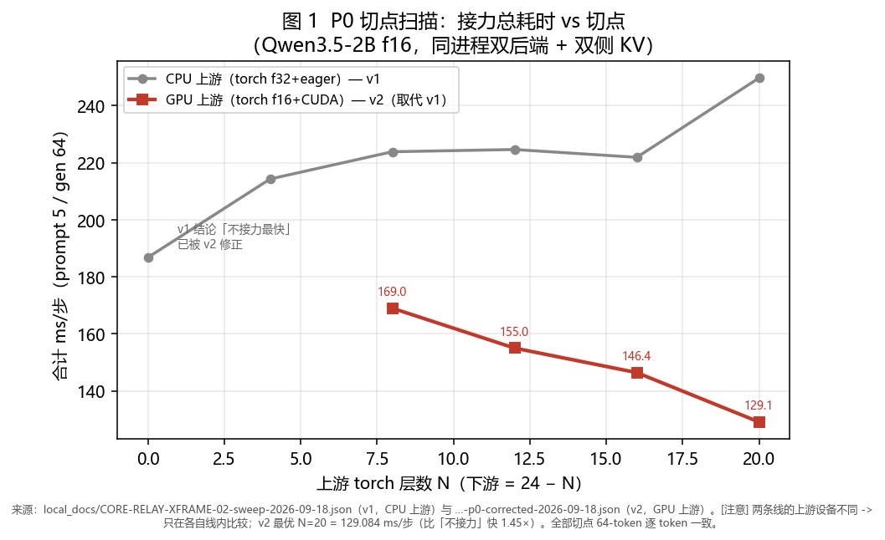
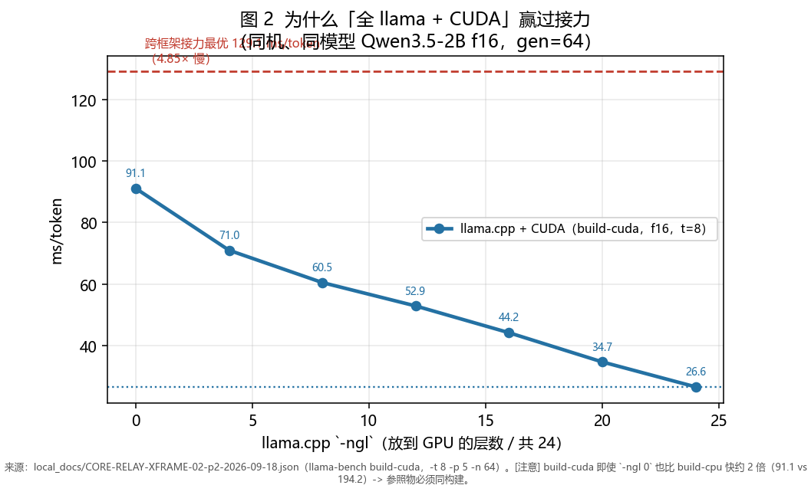
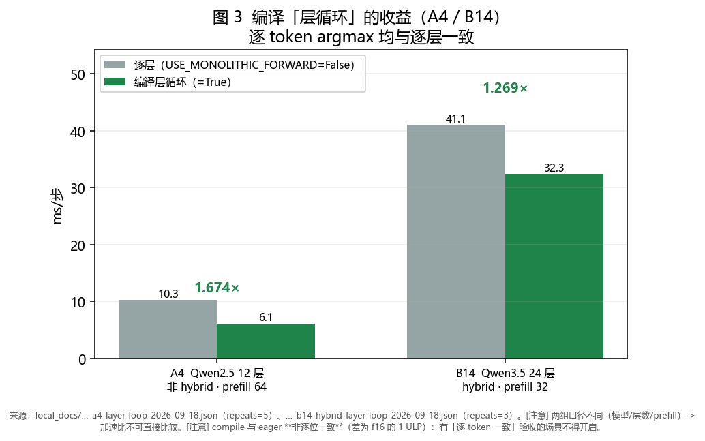
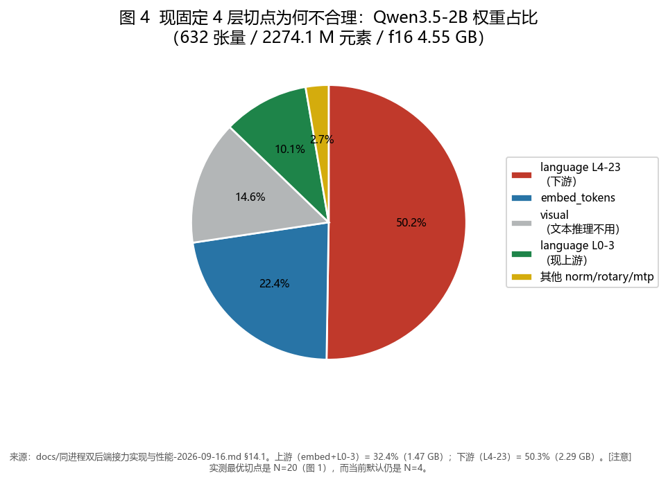
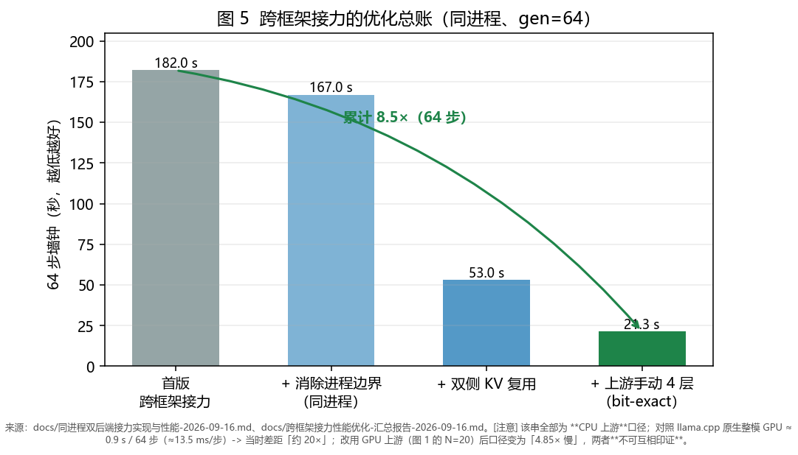
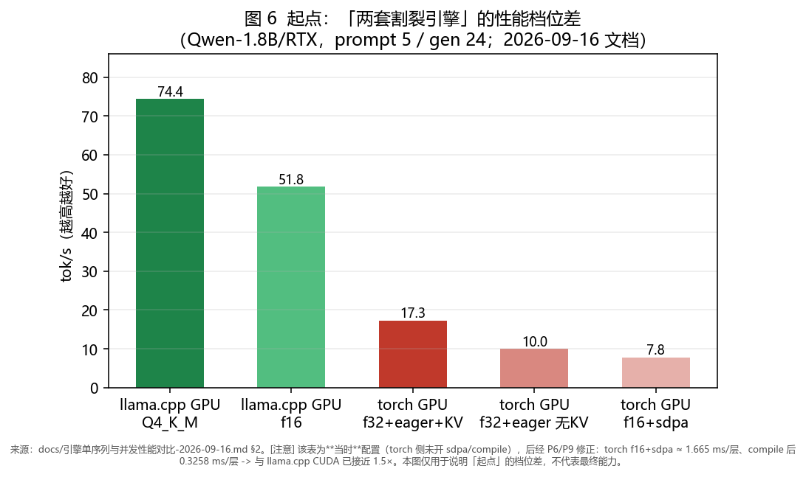
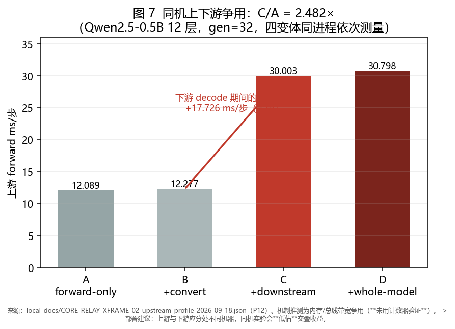

# QLH 跨框架层接力：项目报告

> **状态：持续更新**（最后更新：2026-09-18）
> 配套文件：[`跨框架层接力-实验数据汇总.md`](跨框架层接力-实验数据汇总.md)（全部数字与测试条件；本报告只引其中结论，不重复列数字）
> 相关票：`CORE-RELAY-XFRAME-02`（即 D29）、`CORE-RELAY-XFRAME-01`、`CORE-LAYER-CONTRACT-01`、`CORE-RESHARD-01`、`CORE-LLAMA-PC-RPC-01`、`CORE-LLAMA-ANDROID-01`、`CORE-KOAKUMA-ENGINE-01`、`CORE-TRANSPORT-PORT-01`
> ⚠️ **生产准入**：本报告描述的所有能力，其生产准入门 `admit_relay_xframe` **仍为 fail-closed 关闭**（`src/relay_contract.py`；35 份 `local_docs/CORE-RELAY-XFRAME-02-*.json` 均带此字段）。本报告是**研究进展**，不是投产声明。

---

## 0. 一页摘要

QLH 的目标是让**异构的、算力不均的、网络不佳的设备**（本机 RTX 4060 Laptop 8GB、Surface 无 CUDA、Android 手机）合起来服务一个**装不进单机**的模型。

技术上走了三代，**每一代都是被上一代的实测数据否决后才出现的**：

| 代 | 形态 | 结局 | 否决它的证据 |
|---|---|---|---|
| ① | **两套割裂的引擎**：torch（CUDA/量化）与 llama.cpp（CPU/GGUF）各跑各的，接口对齐但**不做任何跨引擎协作**；分布式只有「等某个节点装下完整模型」的临时回退 | 能力有了，但**装不下的模型依然装不下** | 整模在 8GB 卡上放不下 2B-f16 的 f32 版本 |
| ② | **张量并行（TP）**：把一层里的张量切到多设备 | **从未进入生产**（PoC 即止） | **通信数学**：TP 每 token **48 次 all-reduce**（同步栅栏），RTT 下限 **960ms** ⇒ decode 上限 **~1 tok/s**；且**异构会把 straggler 放大 48 倍/token**。**TP 的瓶颈是 RTT×同步次数，不是带宽** —— 带宽再翻十倍也无解 |
| ③ | **跨框架层接力**（当前主线）：按**层**切分，上游用 PyTorch 跑 `embed + L0..N-1`，把 hidden state 交给下游的 llama.cpp 跑 `LN..last`，**各节点只持有自己那段层的权重** | 研究推进中，**生产门关闭** | 见 §3、§6 |

**一句话定位（v6）**：跨框架层接力是「**异构设备拼进同一条流水线的唯一接口**」，也是一切「可定制」（切点、混合精度、算子、批量）的**前提**；学术上**无对口先例**（Petals 是**同框架** TP、KTransformers 是**算子级**、distributed-llama 是**纯 TP**）。

**当前最大的诚实结论**：在**只有一块可用 GPU** 的现实下，最优切点是「把层尽量交给 GPU 上游」，但即便如此，跨框架接力（GPU 上游 + CPU 下游）**仍显著慢于**「让 llama.cpp 独占 GPU 跑整模」（后者还慢 3–4.9×，口径见汇总文件）。也就是说：**跨框架接力的价值在于「装得下/装得更好」，而不在于「单机更快」** —— 这条边界必须写清楚，否则会误导后续排期。

---

## 1. 起点：两套割裂的引擎（2026-06 ~ 2026-09）

### 1.1 双引擎并存的由来

`src/model_module.py` 与 `src/llama_engine.py` 各自成体系，靠「接口对齐」而非「协作」并存：

- `src/model_module.py` —— PyTorch 系。「双引擎推理 — 自动选择 PyTorch (CUDA) 或 llama.cpp (CPU/集显)」；按设备画像选档：CUDA → PyTorch + bitsandbytes；CPU/集显 → llama.cpp + GGUF（Q4_K_M）。
- `src/llama_engine.py` —— llama.cpp 系。「CPU/集显设备的轻量级推理后端」「接口与 ModelManager 对齐，上游调用者无需修改」。

2026-09-14 的 `docs/QLH定位与模块归属终局决策-2026-09-14.md` 把这件事正式定性为「**双引擎**」（L 档 GGUF 轻量 / D 档 PyTorch 分层分布式），并写下关键判断：

> **PyTorch 不抛弃** —— llama.cpp 不能做分层分布式推理。

这句话是后面一切的地基：**层拆分/层流水线这套能力，只有 PyTorch 侧有**（`model_module.py` 的层拆分与放置、`tcp_comm.py` 的 torch 张量传输、`qwen3_pipeline_*` 运行时）；llama.cpp 侧（`llama_engine.py`）擅长的是**单机高效推理**。

### 1.2 「未多少优化」的具体形态

当时的性能状态可以用三个「没开」概括（全部有仓内证据）：

- **没开并发**：`src/config.py:396` `PIPELINE_MAX_CONCURRENT = 1  # 最大并发流水线任务数（当前仅支持 1，串行执行）`。
- **没开 continuous batching / KV 复用**：llama.cpp 侧为单序列 `llama_decode`；`src/llama_engine.py` 的 `reset_kv_cache()` 是 **no-op**，全仓 `src/` 下 `cache_prompt|prompt_cache|n_cache_reuse` 零命中。
- **没开算子融合**：torch 侧走 eager；实测 f16+sdpa 反而比 f32+eager **慢**（当时的结论，后被逐项修正）。

同期的对照数据（详见汇总文件）显示差距是**数量级**的：llama.cpp GPU Q4_K_M ≈ 74 t/s，而 torch f32+eager+KVCache ≈ 17 t/s（**~4.3×**）。这说明「双引擎」不只是两条技术路线，而是**两个性能档位**。

### 1.3 从未进入生产的张量并行引擎

要准确讲清楚，得把两件常被混为一谈的东西分开：

**(A) mesh 内的 `TensorParallelProvider` —— 从未实现，只有规划。**
`src/` 里**没有任何实现**（grep 只命中 docs）。`docs/整体架构.md:89` 的原文是终局裁定：

> 张量并行本身的结论没有改变：**它不进 mesh。** 已落地的是「把张量并行留在集群之外、由 QLH 编排整请求」的外部辅助形态（路线 A/B 阶段 1 PoC），**不是 mesh 内的 `TensorParallelProvider`；后者仍处于规划阶段**，需要同构 GPU 与高速互联条件才能进入实施。

**(B) 「TP 孤岛」`island` 引擎 —— 实现过，但它不是 TP 本身。**
`src/island_engine.py` 的 PoC 实质是「**把 TP 留在集群外部**」：对集群**自述为单个整请求推理节点**，不接收 `LAYER_FORWARD`、不加载本地层段，真正的 TP collective 完全由孤岛内网的**外部运行时**（vLLM/SGLang/llama-server）完成；QLH 侧只做「上游 host + `--rpc` 聚合」。
⇒ 所以它**从未解决**「多设备合持一个装不下的模型」这个目标问题 —— 它只是「借后端」。

**为什么没进生产（定量根因，见 §2.1）**：不是写不出来，而是**写出来也不快**。

---

## 2. 为什么纯工程路线不可行（定量）

这一节的结论**全部来自实测/计算**，是项目从「工程」转向「半科研半工程」的**直接依据**。

### 2.1 TP 不进 mesh 的通信数学

出处：`docs/张量并行外部辅助与混合拆分调研方案.md`（以 Qwen-1.8B：H=2048、L=24、单 token hidden FP16 = 4KB 代入）：

| 指标 | 层流水线（PP） | TP（N=2 跨机） |
|---|---|---|
| 传输次数（同步点） | **3 次单向 hop** | **48 次 all-reduce** |
| 每节点通信量 FP16 | ~12 KB | ~192 KB |
| **RTT 开销下限 @20ms** | 3×20 = **60 ms** | 48×20 = **960 ms** |

三条被反复引用的判断：

1. **TP 的瓶颈是 RTT×同步次数，不是带宽。** 48 次/token 的同步栅栏在 Tailscale 5–50ms RTT 下，仅 RTT 就吃掉 0.24–2.4 s/token。带宽再翻十倍也无解。（上游 TPI-LLM, arXiv:2410.00531 同样结论："link latency, not bandwidth, emerges as the main issue"）
2. **异构 = straggler 在 TP 中被放大 48 倍/token。** TP 每次 all-reduce 都要等最慢 rank；而 PP 中慢节点只决定吞吐（流水段瓶颈），**可以用层数分配补偿**。
   ⇒ 这一条直接解释了为什么**「按层切」而不是「按张量切」**是异构场景下的正确选择。
3. **prefill 卸载跨 mesh 不可行**：Qwen-1.8B 每 token KV FP16 ≈ 192KB，512 token prompt 的 KV ≈ **96MB**，@100Mbps ≈ 8s，比本地慢速 prefill 还慢。

### 2.2 其它并行手段的逐项否决

`docs/分布式推理并行与跨框架路线调研汇总-2026-09-15.md` 的执行摘要逐项否决：跨节点 TP ❌、序列/上下文并行 ❌、MoE-EP ❌（本机模型非 MoE）、prefill/decode 分离 ❌（KV 需跨节点搬运）、KV 迁移/跨节点缓存 ❌（同一带宽门槛）。

该报告还列了一份**「伪并行清单」**—— 看起来并行、实际受带宽或串行依赖限制：跨节点 TP、跨框架逐层接力、prefill/decode 分离与 KV 迁移、1F1B/zero-bubble、hidden 压缩、RAM 受限多副本。

> ⚠️ 注意清单里**包含**「跨框架逐层接力」—— 它在 2026-09-15 曾被列入「伪并行」。**是后续实测把它从「否决」上调为「可研究」的**（见 §3）。

### 2.3 开源引擎无可直接集成者

调研结论：2026-09 时点上**不存在**可直接集成的「跨异构 + 层/张量拆分」开源引擎。可类比者各有硬边界：

- **Petals** —— **同框架**（同为 torch/transformers），无法跨到 llama.cpp；
- **KTransformers** —— **算子级**（把个别算子卸载到 CPU），不是层拆分；
- **distributed-llama** —— **纯 TP**，正好撞上 §2.1 的通信数学；
- **Silica** —— 「标准 llama.cpp RPC + 比例/上限 offload」，是**借后端**而非**容量合并**；且上游 AGPLv3，QLH 明确不整合其代码。

**⇒ 这就是「无对口先例」的依据**：不是一个都没有，而是**没有一个的边界正好落在「异构 + 跨框架 + 按层」这个交集上**。

---

## 3. 转折：从「工程集成」到「半科研半工程」

### 3.1 重新划界

前两代的共同假设是「**找到一个够强的现成方案并集成进来**」。§2 的数据否定了这个假设：

- TP 类：通信数学上必输（§2.1）；
- 集成类：**没有可集成者**（§2.3）；
- 分工类（prefill/decode 分离、KV 迁移）：都撞上同一带宽/延迟门槛（§2.2）。

剩下的**唯一**可行方向，是 2026-09-15 调研报告给出的那句：「**真瓶颈是弱节点算力与每步同步（非带宽）**」。由此收敛出三层定位：

1. **能落地的工程**：只传 token 的机制（continuous batching、draft-verify、级联/路由、本地 prefix cache）—— 这部分**照常做工程**。
2. **需要研究的**：跨框架**层**接力（异构+装不下）—— 这部分**没有先例可抄**，必须自己做实验、发自己的结论，**按研究的标准要求证据**（同进程复测、带 std、单变量分离）。
3. **明确不做的**：mesh 内 TP、序列并行、MoE-EP、跨节点 KV 迁移 —— 有定量否决理由，**不再投入**。

**「半科研半工程」的具体含义**，在流程上表现为三条纪律（本项目反复吃亏后立的规矩）：

- **必须用主仓引擎**做实验（`src/model_module.py` / `src/llama_engine.py`），**手写前向有方法论问题**（会测出主仓根本不会出现的数字）；
- **只写同进程、同条件复测过的对比数字**；跨报告/跨脚本的数字**不构成对照**；
- 凡「A 比 B 快多少」类结论，必须**单变量分离 + 重复测量 + 给出 std**。

### 3.2 跨框架层接力的定位

「Relay 与 RPC 是两条不同能力」是项目内部反复澄清的一句话（`docs/主线开发计划-分布式推理与边缘优化-2026-09-14.md`）：

> 前者（Relay）验证**架构兼容与跨引擎组合**，后者（RPC）解决**模型部分驻留**。

今天的形态是把**两者分工**：
- **层接力**负责「**异构设备拼进同一条流水线**」；
- **RPC/分片**负责「**借算力**」（llama.cpp `--rpc`，host 侧加载，后端只出设备/内存）。

---

## 4. 今天的架构

```
      ┌──────────── 上游节点（本机 · RTX 4060 · PyTorch）────────────┐
      │  embed_tokens + L0..L(N-1)                        （1.47 GB） │
      └──────────────────────────┬───────────────────────────────────┘
                                 │  hidden state（每步 1 行，FP16）
                                 ▼
      ┌──────────── 下游节点（llama.cpp · CPU/GPU）──────────────────┐
      │  chipped GGUF: L(N)..L(23) + norm + (tied) lm_head（2.29 GB）│
      └──────────────────────────────────────────────────────────────┘
```

**关键契约**：

| 项 | 内容 |
|---|---|
| 层拆分 | `src/model_module.py::load_layer_range(start, end, has_embedding, has_lm_head)` ⇒ 每节点**只持有自己那段层的权重** |
| 数据面 | 段间只传 **hidden state**（每步 1 行）；`forward_layers()` 的入参为 `input_ids`（首节点）或 `hidden_states`（中间/末节点） |
| **KV cache** | **节点本地**（`src/scheduler.py` 的 `_kv_cache`：`task_id → past_key_values（本节点层范围的 KV）`）⇒ **KV 不跨节点传** |
| 消息 | `LAYER_FORWARD` / `LAYER_RESULT`；`use_kv_cache=False` 为 prefill（处理完整序列、构建 cache），`True` 为 decode（增量） |
| 契约 | `src/relay_contract.py`（`RelayHiddenSpec` / `RelayHandoff` / `admit_relay_xframe`）；节点类型 `local / remote_rpc / remote_pipeline / cross_framework` |
| 裁层工具 | `scripts/cut_layers.py`（离线生成「去掉前 N 层」的 GGUF；与 `RelayTrimPlan` 语义对齐，K=12 产物与实验区 sha256 逐字节相同） |
| 生产门 | `admit_relay_xframe`，**fail-closed 关闭** |

**两台机器上的实现边界（重要）**：
- **Android** = 另一条路线（llama.cpp RPC **借算力**）。⚠️ **语义澄清（2026-09-19 用户裁决 + 代码核实）**：被排除的是 **PyTorch**（`src/scheduler.py:3754` 的注释原文即「Android **无 PyTorch** 推理能力」），**不是 llama** —— 即 **Android 跑 llama.cpp 的层段（L 段）在机制上不在排除之列**；但**当前实现比理由更宽**（`scheduler.py:3756` 是「阻止 Android 被分配层」，不分 llama/torch）⇒ **若要走 Android-as-L-segment，需要把该门按 backend 细化**。原表述：主仓**硬性排除** Android 参与层拆分（`src/scheduler.py:3754`「阻止 Android 节点被分配层（Android 无 PyTorch 推理能力）」、`:2620`「仅 PC 节点参与层拆分，Android 节点跳过」）。其唯一计算形态是**整请求级**的 `full_inference` stage（`android_full_worker`，加载整模）。
- 因此**当前层接力是 PC-only 的 D→L（PyTorch → llama.cpp）**。

---

## 5. 克服的困难与踩过的坑

> 按性质分五类。每条都给证据；带 ⚠️ 的是「**曾经的结论后来被推翻**」，写在这里是提醒不要重犯。

### 5.1 语义类（最难，因为它不报错，只是算错）

1. **`has_lm_head=False` 时漏做 `norm`** —— 分段前向必须返回**未过 norm** 的 raw hidden（`src/model_module.py:239` 有明确注释），但**验证脚本**若照抄「算 logits」的直觉就会漏掉 `transformer.norm`，导致 logits 差异巨大（曾出现 `max|diff|=12.47`）。**这是脚本错、不是实现错** —— 但排查花了一整个来回。
2. **`Qwen2Model.forward()` 的返回值语义 vs 分段前向** —— A4 第一版试图直接 `torch.compile` **整段 `Qwen2Model`**，得到 2.325×、但**多算了一次 `self.norm`**，argmax 从 decode 第 1 步就分叉。⇒ 定下原则：**不编译/不整段调用会 apply `self.norm` 的模型**，只编译「层循环」。修正后：1.674× 且 argmax 与逐层完全一致。
3. **hybrid 的 mask 是「按层不同」的** —— Qwen3.5 有 18 层 `linear_attention` + 6 层 `full_attention`，**每层要的 mask 不同**（causal vs recurrent）。最初用「有无 `layer_types`」判断 hybrid，结果 transformers 5.x 给 `Qwen2Config` **也**加了 `layer_types`（24/24 全 `full_attention`）⇒ 纯 full-attention 模型被误判 ⇒ RoPE 张量维度错乱。
4. **KV cache 的「本地层索引」语义** —— `past_key_values` 的索引是「**本节点本地层**」（`src/model_module.py:3039`），不是全局层号。任何跨界传递都会错位。

### 5.2 数值类

5. **hybrid 的 linear 层不写 KV** —— Qwen3.5 的 `linear_attention` 层用**递归状态**（conv/recurrent state）而非 KV。⇒ 把 cache 转 tuple 时**跳过 `None`**，会让 tuple 只剩 6 项（=full_attention 层数）而本地有 24 层 ⇒ decode 报「层数不匹配」且**下标错位**。修法：**保留 `None` 占位**。
   - ⚠️ **这个坑 A3 时没暴露**，因为 A3 **只验证了 prefill**；是 B14 的 decode 验证抓到的。**教训：分段前向的验证必须覆盖 decode。**
6. **`DynamicCache(config=...)` 按 config 建槽** —— 分段加载时 config 仍是**完整模型**层数（4 层模型取 2 层 ⇒ 多出的槽是 `None`），会把 tuple 撑长。修法：只取本段实际层数。
7. **compile 不是 bit-exact，但也不能说它「更差」** —— 逐项排除（`emulate_precision_casts`、`split_reductions`/`deterministic`、`epilogue_fusion`、autotune/CUDA Graphs、GEMM 实现）后，**唯一剩余来源是 attention 实现通路**（`fuse_attention` 把 bmm+softmax 融回 aten SDPA）；差异量级恰为 **f16 的 1 ULP**（`0.015625 = 2^-6`）。上游 issue 原话指出 compile 版本对照 **float64** 基线时 **rtol 更好** ⇒ **正确表述是「与 eager 非逐位一致」，不是「compile 更差」**。
   - **推论（重要）**：有「逐 token 一致」验收判据的场景，**不得开启 compile**。
8. **低精度在 torch 侧没有速度收益（反直觉）** —— 上游 f16 反而**慢 8.4×**、bf16 慢 8.7×；而 NF4（量化内核）只慢 1.09×。⇒ 「4 层 + batch=1」是**延迟受限**而非带宽受限。

### 5.3 系统 / 运行时类

9. **同机上下游的 2.8× 偏差** —— 真的让两个后端同时跑（上游 torch GPU + 下游 llama.cpp CPU），上游 forward 从 12.089 涨到 30.003 ms/步（**C/A = 2.482×**），其中 **+17.726 ms 全来自「下游 decode 期间对上游的干扰」**（推测为内存/总线带宽争用，**未用计数器验证**）。
   ⇒ 这解释了为什么「单步孤立测量」会比整链路快 —— **脱离端到端链路的孤立测量不可信**（曾把上游单步测低约 5.6×）。
10. **llama.cpp RPC device 注入与 repack** —— 显式 devices（RPC/分片）时 **repack 不参与** ⇒ 全 RPC ≡ 分片 ≡ 本机 no-repack（逐比特一致）；唯一异类是本机默认 repack。
11. **退出码非零** —— hybrid + compile 时，解释器清理期可能崩（`_PyModule_ClearDict` 调用栈）⇒ 登记 `atexit`，在清理**之前**有序释放编译对象与 CUDA 缓存。
12. **torch.compile 的 guard 陷阱** —— `layer.self_attn.layer_idx` 等属性会被纳入 guard ⇒ **必须在编译前定成最终值**（分段加载时「本地索引」才是正确的）；旧写法「每次调用临时改再恢复」会**反复触发重编译**。另有 `recompile_limit`（8→64 额外 **+44%**）与 **thread-local** 陷阱。
13. **`Transformers` 版本锁** —— 主运行时钉 `>=4.47.0,<4.48.0`，硬原因是 `transformers_stream_generator 0.0.5`（Qwen-1.8B remote code 的 `chat_stream` 依赖）在 5.x 必然导入失败；而 5.x 的 `check_imports` 会在加载**任何** remote code 时 import 其声明的依赖，**非 "No module named" 的 ImportError 直接抛** ⇒ 连模型都加载不了。⇒ 新增 `src/transformers5_compat.py` 补回 5 个符号（占位类 fail-loud）。
14. **tied embeddings 的末节点缺张量**（B13 发现）—— Qwen3.5 是 tied embeddings，safetensors 里**没有 `lm_head.weight`**，而分层加载的完整性校验**硬要求**它 ⇒ **tied 模型无法做「末节点」**（`RuntimeError: qwen2 分层权重不完整: lm_head.weight`）。

### 5.4 测量方法学类（本项目「踩坑密度」最高的一类）

15. **跨报告比较之误（两次）** —— 例如曾断言「`forward_layers()` 手动逐层比整段前向慢约 3×」，实为**跨报告比较**；同进程实测只慢 1.318×，且两路径 hidden `max|diff|≈44.365` ⇒ **性能可比、数值不可比**。
16. **`-r 1` 不可采信** —— llama-bench 跨运行漂移可达 **12–17%**；曾据此误判「-fa 对 prefill +6.2%」（已撤销）。
17. **脚本没有在测被测对象** —— 一次「长序列 compile 劣化」的结论（24 步 1.904× → 141 步 0.672×）实因**脚本取错模块**；修正后为 1.79–2.57×。**教训：先证明测量脚本在测被测对象。**
18. **分段计时的 sync 伪影** —— 某段显示 8.78ms，单独实测仅 0.013ms：因为它**没有前置 sync**，吸收了上一步的异步尾部。⇒ 分段计时的每一段都必须自带前后 sync。
19. ⚠️ **被后续实测撤销的结论清单**（`local_docs/CORE-RELAY-XFRAME-02-TODO-v2-2026-09-18.json` 集中列出）：B1 的「长序列 compile 劣化」、B6 的「static cache 最优」、cache-mechanism 之前的「compile 下 hybrid 恒定慢 1.5×」（实为**快** 1.57×）、「IPC 是瓶颈」、「不接力最快」、「退出期崩溃」、「上游逐层慢 3×」、以及 README 里「慢约 20×」的口径。
   ⇒ **本报告一律以最新实测口径为准**，并在汇总文件里给每个数字标注来源与条件。

### 5.5 工程环境类

20. **Windows / 非 UTF-8 的 GBK 陷阱** —— 非 UTF-8 模式下 `torch.compile` 会抛 GBK 解码错误 ⇒ 启动脚本统一设 `PYTHONUTF8=1` / `PYTHONIOENCODING=utf-8`；`.bat` 必须**纯 ASCII**（GBK 读入会拆碎中文字节）。
21. **DLL 目录** —— `ctypes.CDLL("ggml.dll")` 在 cwd 不在 lib 目录时 `exit 127`（依赖 DLL 找不到）⇒ 必须在 `import llama_cpp` **之前** `os.add_dll_directory`。
22. **依赖落点** —— `triton-windows` 只进单独的 `requirements-compile.txt`（可选加速；Linux 不需要），`gguf` 进主 requirements（`scripts/cut_layers.py` 是主仓工具）；未装 triton 时 `_apply_compile()` 告警并回退 eager。
23. **CUDA 版 `llama-cpp-python` 未构建** —— 导致同进程模式**无法使用下游 GPU offload**（跨进程可以）；且 `causal_conv1d` 编译四次失败（CUDA 12.6 的 `cudafe++` 与 MSVC 14.51 不兼容）。
24. **tied embeddings / 多模态外壳** —— Qwen3.5 的 safetensors key 带 `model.language_model.` 前缀、层数放在 `text_config` 下、另有 `model.visual.*` 视觉塔与 `mtp.*` ⇒ 需要 key 前缀自动探测与 `text_config` 兼容（A2/A3）。

---

## 6. 进展

### 6.1 阶段性结论（按证据强度排序）

| 结论 | 证据 |
|---|---|
| **段间只传 hidden 是可行的**，切点两端可跨框架（PyTorch ↔ llama.cpp）；多种切点在 f16/f32 下**逐 token 一致**（141/141、64/64） | `CORE-RELAY-XFRAME-01`（cosine min 0.99999953）、P0 扫描（全部切点 `tokens_digest` 相同） |
| **上游只加载自己那段层**（不加载整模）可行且**数值 bit-exact** | 上游 `embed+L0-3` 1.47 GB（vs 整模 4.55 GB），`missing=1(norm.weight)`，`max|diff|=0` |
| **切点应该尽量靠后**（层交给 GPU 上游）：GPU 上游 N=20 最优 | 修正后最优 **N=20 = 129.084 ms/步**，比「不接力」快 **1.45×**；拟合上游 2.4842 ms/层 vs 下游 5.6906 ms/层 |
| **上游 torch 引擎本体已接近 llama.cpp CUDA** | `forward_layers` 1.1109 vs 1.064 ms/层 = **1.044×**（Qwen2.5-0.5B, 12 层） |
| **编译「层循环」有效**（默认关） | 非 hybrid **1.674×**（Qwen2.5 12 层）；hybrid（Qwen3.5 24 层，B14）**1.269×**，两者 argmax 均与逐层一致 |
| **同机双后端交叠有效** | serial 101.113 → threaded **78.308 ms/token = 1.291×**（理论天花板 1.79×，达约 72%） |
| **hybrid（Qwen3.5）能分段加载与前向**，且同机两段流水线逐 token argmax 与单段一致 | A3；B13（见 §6.2） |

### 6.2 最近两项（2026-09-18）

- **A5 —— 依赖与环境整理 + transformers 5.x 兼容**：`gguf` 入主 requirements、`triton-windows` 单列 `requirements-compile.txt`；`.venv-test` 从 4.47.1 升到 5.17.0，过程中修掉 4 类问题（hybrid 误判 / `DynamicCache` 宽容 / remote code 导入 shim / **既存的测试间污染**）。全量 2768 passed（唯一失败是早已确认的并发 flaky）。
- **B14 —— 编译层循环支持 hybrid 的 per-layer mask**：hybrid 现在也能吃到编译收益（**1.269×**，argmax 一致）。**顺带修掉 A3 遗留的 hybrid decode KV 占位 bug**（§5.2 第 5 条）。
- **B13 —— Qwen3.5 的 hybrid 递归状态在层流水线里的传递**（**已完成**）：**结论是「段间不需要传任何 cache」** —— 契约本就如此（`past_key_values` 索引对应**本节点本地层**；`_kv_cache` 按 `task_id` 存「本节点层范围的 KV」）。hybrid 的 `linear_attention` 层不写 KV、用 conv/recurrent state，**只依赖本层的输入序列** ⇒ 只要 **prefill 阶段上游把完整序列的 hidden 交给下游**，下游就能从 token 0 正确累积 ⇒ **hybrid 不引入额外的跨节点状态传输需求**。
  **实测**（同进程，Qwen3.5-2B，split=12，prefill=16，gen=32，repeats=3）：上游 0-11 **25.251 ± 0.232** ms/步、下游 12-23 **23.960 ± 0.602** ms/步、合计 **49.211 ms/步**；**逐 token argmax 与单段 0-24 完全一致**（33 个 token，首个差异 None）。
  **副产品（主仓真缺陷，未修）**：**tied 模型（Qwen3.5）无法做「末节点」** —— `has_lm_head=True` 抛 `qwen2 分层权重不完整: lm_head.weight`，根因是 tied embeddings 的 safetensors 里没有 `lm_head.weight`；且 `has_embedding=False` 时本地也没有 `embed_tokens` 可借。跨框架接力不受影响（下游是 llama.cpp），受限的是**纯 PyTorch 层流水线的末节点**。已登记为 `TODO-B16`。

### 6.3 与「不接力」的对照（必须写明的边界）

同一台机器、同一模型 f16：

| 配置 | ms/token |
|---|---:|
| **llama.cpp + CUDA**（`-ngl 24` 全层 GPU） | **26.6** |
| 跨框架接力最优（GPU 上游 N=20 + CPU 下游） | 129.084（**4.85× 慢**） |
| 跨框架接力（threaded 交叠） | 78.308（约 **2.9× 慢**） |

⇒ **结论**：在**单机有可用 GPU** 时，跨框架接力**不是**性能优化手段。它的价值在**容量与异构**（装不下的模型、无 CUDA 的节点）。这条边界必须写进任何对外说明。

### 6.4 图集

所有图由 `build/cross-framework-layer-poc/make_figures.py` **直接从** `local_docs/CORE-RELAY-XFRAME-02-*.json` 生成（不手绘、不推算；缺字段则跳过并报告），输出在 `docs/figures/cross-frame-relay/`。每张图的图注都带**来源**与**测试条件**。

**图 1 — P0 切点扫描：接力总耗时 vs 切点**（v1 CPU 上游 已被 v2 GPU 上游修正；最优 N=20）



**图 2 — 为什么「全 llama + CUDA」赢过接力**（`-ngl` 曲线，唯一大杠杆）



**图 3 — 编译「层循环」的收益（A4 / B14）**



**图 4 — 现固定 4 层切点为何不合理**（权重占比：L0-3 仅 10.1%、L4-23 占 50.3%）



**图 5 — 优化总账累进**（182 s → 21.3 s，8.5×；⚠️ 该串为 CPU 上游口径）



**图 6 — 起点：两套割裂引擎的性能档位差**（仅说明起点，不代表最终能力）



**图 7 — 同机上下游争用**（P12：C/A = 2.482×，主因是下游 decode 期间对上游的干扰）



---

## 7. 结论与边界

**成立的**
1. 「**按层切、只传 hidden、各节点自持 KV**」这套跨框架层接力在**语义上成立**，且已被多切点、多精度、多模型（Qwen2.5 / Qwen3.5 hybrid）实测支持；
2. 「**异构设备拼进同一条流水线**」这一目标**只有这条路**能达成（TP 被通信数学否决，集成类无可集成者）；
3. 上游引擎本体性能**已接近** llama.cpp CUDA（1.044×），瓶颈已从「引擎」转移到「链路与下游」。

**不成立的 / 不做**
1. mesh 内 TP、序列并行、MoE-EP、跨节点 KV 迁移 —— **有定量否决理由，不再投入**；
2. 「跨框架接力能让单机更快」—— **不成立**（§6.3）；
3. 有「逐 token 一致」验收的场景 **不得开 compile**。

**未完成 / 待办**
1. **生产门仍 fail-closed 关闭**（★ 2026-09-19 收口：准入所需的**四项证据已在本机范围补齐**，但**结论是不做默认生产路由**——见下）；
   * **prompt 分布统计** ✅ 已补：8 条不同分布族（英文事实/推理/长文、中文问答/指令、代码、数学、技术定义），D→L 与 L→L **各 8/8 逐 token 全一致**（`out/xframe-prompt-dist.json`）；
   * **长序列** ✅ 已补：prefill **64/128/256/547 token** 四档全部逐 token 一致（此前只到 141）。其中 512 档起初令对照工具以 `0xC0000409`（stack buffer overrun）**崩溃**，根因是 `relay-gen.cpp` 的 `n_ctx`/`n_batch` **硬编码 512** ⇒ 已改为可配置（`--n-ctx`）并加**越界前置检查**，不再崩溃而是明确报错（`out/xframe-longseq*.json`）；
   * **弱网断线** ✅ 已补：新增 `tests/test_relay_failclosed_network.py`，覆盖慢响应超时、runner 中途死亡、**乱序/重放 sequence**、**非 loopback 端点拒绝**、runner 异常回 ERROR 帧；并**加固了桥**——原先只捕 `(OSError, RelayProtocolError)`，runner 抛其它异常时**不回错误帧、对端永久挂死**，现任何异常都转 ERROR 帧；
   * **跨节点时钟与协议版本一致性** ✅ 已补（本机范围）：`out/xframe-consistency.json` 固化下游 llama.cpp 构建指纹（commit `6f04274cc` / branch `pr-27073` / **8 个本地补丁及其 SHA-256**）、Relay 线协议常量（`QLHR` / `wire_version=1` / `float32_le` / header `!4sBBHIIQ`）、上游指纹与时钟基准。**结论：两侧必须同构建**——实验 fork 带本地补丁，构建不一致时逐 token 一致结论不成立 ⇒ 跨节点部署必须核验该指纹。
   ⇒ **四项齐备后准入判定仍为拒绝**，理由已从「缺证据」精确化为「**正确性已验证、性能不具优势**」（合同新增 `RelayXFrameEvidence`，见 `src/relay_contract.py`）；
2. 切点仍**固定 4 层**（而实测最优在 N=20）—— 权重占比也不合理：`L0-3` 仅 **10.1%**、`L4-23` 占 **50.3%**；
3. ~~**tied 模型的末节点**（§5.3 第 14 条）需修~~ ⇒ **已在 B16 修复（2026-09-18）**：新增 `_is_tied_word_embeddings()` 探测，tied 模型改用 `embed_tokens` 充作 `lm_head` 并重绑为同一 Parameter（共享、零额外内存）；Qwen3.5 现可直接做末节点且 argmax 与既有口径一致，新增 `tests/test_tied_word_embeddings.py`（7 passed）。
4. Android 路线（借算力）**被设备阻塞**（真机硬门未完成），且与层接力**互不替代**。

---

## 8. 参考

- 数据与条件：`docs/跨框架层接力-实验数据汇总.md`
- 契约：`src/relay_contract.py`、`src/pipeline_node_contract.py`、`src/task_worker_protocol.py`
- 引擎：`src/model_module.py`（PyTorch 系）、`src/llama_engine.py`（llama.cpp 系）、`src/island_engine.py`
- 决策：`docs/QLH定位与模块归属终局决策-2026-09-14.md`、`docs/QLH异构分布式形态决策-2026-09-14.md`、`docs/整体架构.md`
- 调研：`docs/分布式推理并行与跨框架路线调研汇总-2026-09-15.md`、`docs/张量并行外部辅助与混合拆分调研方案.md`、`docs/Silica式分片方案调研-2026-09-17.md`
- 实测：`docs/同进程双后端接力实现与性能-2026-09-16.md`、`docs/跨框架接力性能优化-汇总报告-2026-09-16.md`、`local_docs/CORE-RELAY-XFRAME-02-*.json`（35 份）
- 票表：`docs/验收清单与资源限制登记.md`（D29）、`local_docs/CORE-RELAY-XFRAME-02-TODO-v2-2026-09-18.json`
